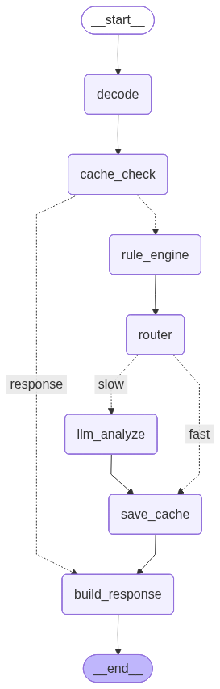

# LangChain SOC Analyzer

**Lightweight HTTP Request Analysis System** using OWASP CRS Rule Engine + LLM (LangGraph) with Cache-First Architecture and HuggingFace API embeddings.

A production-ready security analysis pipeline combining:
- **📦 Ultra-Lightweight**: 415MB CPU-only Docker image (no PyTorch/CUDA)
- **⚡ Cache-First**: Instant responses (<50ms) for repeated requests
- **🚀 Fast Path**: Rule-based detection (50-200ms) for obvious attacks
- **🧠 Slow Path**: LLM analysis (2-5s via Groq) for complex/unknown patterns
- **🔍 RAG-Enhanced**: Vector search with real-world attack examples
- **📊 Explainable Output**: Threat scores, evidence, and recommendations

## Features

✅ **Cache-First Performance**
- Persistent file-based caching (`data/cache_data.pkl`)
- Instant analysis (<50ms) for repeated HTTP requests
- Reduces redundant API calls to LLM and embedding services

✅ **Hybrid Architecture**
- **Fast Path**: Rule engine detects obvious attacks (score ≥ 5) in 50-200ms
- **Slow Path**: Groq LLM analyzes ambiguous patterns (score < 5) in 2-5s
- **Router Node**: Intelligent path selection based on threat score

✅ **RAG-Enhanced LLM Analysis**
- HuggingFace API embeddings (384-dimensional vectors)
- Qdrant vector store for similarity search
- Contextual examples from CSIC2010 dataset enriches LLM decisions

✅ **Explainable & Rich Output**
- Threat scores (0-100 scale)
- Detected attack types and evidence
- Recommended actions (BLOCK/LOG/MONITOR/ALLOW)
- Educational notes for security learning

✅ **Comprehensive Attack Detection**
- SQL Injection, XSS, Command Injection, Path Traversal, LDAP Injection
- Buffer Overflows, Cross-Site Request Forgery, and more
- Powered by OWASP Core Rule Set patterns

## Architecture

State machine pipeline using LangGraph with 7 nodes processing HTTP requests through cache-first logic. Requests are analyzed at multiple levels before returning a verdict.

### System Flow Diagram



### 7-Node Pipeline Flow

```
Request → [Decode] → [Cache Check] ──→ [HIT] → [Response]
                          ↓ [MISS]
                    [Rule Engine] (score calculation)
                          ↓
                     [Router] (score ≥ 5?)
                    ↙ FAST           SLOW ↘
            [Save Cache]         [LLM Analyze]
                    ↘                  ↙
                    [Build Response] → Output
```

**Node Descriptions:**
- **Decode**: Preprocess and validate HTTP request
- **Cache Check**: Return cached result if exists (<50ms)
- **Rule Engine**: Score threat level using OWASP CRS patterns (50-200ms)
- **Router**: Decision point - FAST path if score ≥ 5, else SLOW path
- **LLM Analyze**: Groq analysis for borderline cases with RAG context (2-5s)
- **Save Cache**: Persist result to `data/cache_data.pkl` for future requests
- **Build Response**: Format final output with scores, evidence, recommendations

### Project Structure

```
LangChain/
├── api.py                    # FastAPI 8000 /analyze endpoint
├── graph_app.py              # Main 7-node LangGraph pipeline
├── soc_state.py              # Pydantic state schema
├── 
├── backends/                 # 7 backend services
│   ├── rag_backend.py        # HuggingFace + Qdrant vector search
│   ├── rule_engine.py        # OWASP CRS pattern matching
│   ├── llm_backend.py        # Groq LLM integration
│   ├── cache_backend.py      # File-based cache operations
│   ├── batch_decoder.py      # Batch request processing
│   ├── llm_backend_mock.py   # Mock LLM (for testing)
│   └── __init__.py
│
├── nodes/                    # 7 LangGraph nodes
│   ├── nodes_cache.py        # Cache check node
│   ├── nodes_cache_save.py   # Cache save node
│   ├── nodes_rule.py         # Rule engine node
│   ├── nodes_router.py       # Fast/slow router
│   ├── nodes_llm.py          # LLM analysis node
│   ├── nodes_response.py     # Response builder node
│   └── __init__.py
│
├── builders/                 # Response & audit builders
│   ├── response_builder.py   # Format analysis response
│   ├── audit_logger.py       # Log analysis results
│   └── __init__.py
│
├── scripts/                  # Utility scripts (7 files)
│   ├── visualize_graph.py    # Generate LangGraph PNG/Mermaid
│   ├── seed_rag.py           # Quick test seed (6 examples)
│   ├── seed_rag_from_csic.py # Full dataset seed (61k items)
│   ├── debug_cache.py        # Cache inspection
│   └── ...others
│
├── tests/                    # Test suites (10 files)
│   ├── test_all_features.py  # Comprehensive verification (✅ PASSING)
│   ├── demo_fast_slow_paths.py
│   ├── test_rag_search.py
│   ├── sanity_check.py
│   └── ...others
│
├── docs/                     # Documentation (19 files)
│   ├── PROJECT_OVERVIEW.md
│   ├── CACHE_FIRST_ARCHITECTURE.md
│   ├── DOCKER_SETUP.md
│   ├── FAST_SLOW_PATH_DOCS.md
│   └── ...others
│
├── data/                     # Data directory
│   └── cache_data.pkl        # Persistent cache file
│
├── artifacts/                # Generated outputs
│   ├── langgraph.png         # LangGraph visualization
│   └── langgraph.mmd         # Mermaid source
│
├── docker-compose.yml        # Full stack (Qdrant + API)
├── docker-compose.hf.yml     # HF API variant
├── Dockerfile.hf             # Ultra-lightweight image (415MB)
├── requirements-hf.txt       # Minimal dependencies
├── .env.example              # Configuration template
├── README.md                 # This file
└── venv_langgraph/          # Virtual environment
```

## Technology Stack

| Component | Technology | Notes |
|-----------|-----------|-------|
| **Framework** | LangGraph | State machine orchestration |
| **API Server** | FastAPI | HTTP server on port 8000 |
| **Embeddings** | HuggingFace API | 384-dim vectors (no local models) |
| **Vector DB** | Qdrant | Persistent storage for attack patterns |
| **LLM Analysis** | Groq | `llama-3.3-70b-versatile` model |
| **Caching** | Pickle file | `data/cache_data.pkl` |
| **Container** | Docker | 415MB CPU-only image |
| **Python** | 3.10+ | Lightweight dependencies |

## RAG Dataset Setup

The system uses **Retrieval Augmented Generation (RAG)** to provide contextual attack examples to the Groq LLM. A local Qdrant instance stores embeddings from the `nquangit/CSIC2010_dataset_classification` dataset.

**Setup Steps:**

1. **Start Qdrant (Docker):**
   ```bash
   docker compose up -d
   ```
   Qdrant will be available at `http://localhost:6333`

2. **Activate virtual environment:**
   ```bash
   # Windows
   venv_langgraph\Scripts\activate
   
   # macOS/Linux
   source venv_langgraph/bin/activate
   ```

3. **Set up `.env` file:**
   ```bash
   cp .env.example .env
   # Edit .env and add your Groq API key:
   # GROQ_API_KEY=your-api-key-here
   # HF_TOKEN=your-hf-token-here (optional)
   ```

4. **Seed the RAG database:**
   ```bash
   # Quick test (6 examples, ~30 seconds):
   python scripts/seed_rag.py
   
   # Full dataset (61,792 examples, ~2-5 minutes):
   python scripts/seed_rag_from_csic.py
   ```

5. **Verify Qdrant:**
   ```bash
   curl http://localhost:6333/health
   ```
   Should return: `{"status":"ok"}`

**Note:** RAG seeding is required before running the API. The system will fail if the Qdrant collection is empty.

## Quick Start

### 1. Clone & Install

```bash
git clone https://github.com/VyyKa/AI-Analysis-HTTP.git
cd AI-Analysis-HTTP

# Create virtual environment
python -m venv venv_langgraph

# Activate (Windows)
venv_langgraph\Scripts\activate

# Activate (macOS/Linux)
# source venv_langgraph/bin/activate

# Install dependencies (lightweight, HF API variant)
pip install -r requirements-hf.txt
```

### 2. Set Environment Variables

```bash
# Copy example file
cp .env.example .env

# Edit .env with your keys:
# GROQ_API_KEY=gsk_...   (get from https://console.groq.com)
# HF_TOKEN=hf_...        (optional, get from https://huggingface.co/settings/tokens)
# QDRANT_URL=http://localhost:6333
# QDRANT_COLLECTION=soc_attacks
```

### 3. Start Qdrant (Docker)

```bash
docker compose up -d
```

Verify it's running:
```bash
curl http://localhost:6333/health
# Response: {"status":"ok"}
```

### 4. Seed RAG Database (Required)

```bash
# Quick test (6 examples):
python scripts/seed_rag.py

# Verify collection created:
# - Check Qdrant dashboard at http://localhost:6333/dashboard
# - Or run scripts/debug_cache.py for info
```

### 5. Run API Server

```bash
# Option A: Development
python api.py

# Option B: Production with uvicorn
python -m uvicorn api:app --host 0.0.0.0 --port 8000
```

API available at: `http://localhost:8000`
Interactive docs: `http://localhost:8000/docs`

### 6. Test the API

```bash
# Test 1: SQL Injection (FAST path - obvious threat)
curl -X POST http://localhost:8000/analyze \
  -H "Content-Type: application/json" \
  -d '{"requests": ["id=1 OR 1=1"]}'

# Test 2: XSS Attack (FAST path)
curl -X POST http://localhost:8000/analyze \
  -H "Content-Type: application/json" \
  -d '{"requests": ["<script>alert(1)</script>"]}'

# Test 3: Normal request (FAST path - benign)
curl -X POST http://localhost:8000/analyze \
  -H "Content-Type: application/json" \
  -d '{"requests": ["GET /api/users HTTP/1.1"]}'
```

**Example Response:**
```json
{
  "analysis_id": "req_123456",
  "timestamp": "2025-02-13T10:30:45.123456Z",
  "requests": [
    {
      "request": "id=1 OR 1=1",
      "threat_score": 95,
      "threat_level": "CRITICAL",
      "detected_types": ["SQL_INJECTION"],
      "action": "BLOCK",
      "evidence": ["OR operator outside quotes", "Boolean logic pattern"],
      "recommendations": ["Block IP immediately", "Log attempt", "Alert security team"],
      "path": "FAST"
    }
  ]
}
```

## Testing

All tests pass ✅ (verified with comprehensive test suite)

### Run All Tests

```bash
# Comprehensive verification of all 6 components
python tests/test_all_features.py

# Results:
# ✅ Module imports
# ✅ HuggingFace API (384-dim embeddings)
# ✅ Qdrant search
# ✅ Cache backend
# ✅ Rule engine (FAST path)
# ✅ API integration (FAST + SLOW paths)
```

### Individual Test Suites

```bash
# Fast/Slow path demonstration
python tests/demo_fast_slow_paths.py

# RAG search functionality
python tests/test_rag_search.py

# Cache operations
python tests/test_cache_flow.py

# Full end-to-end pipeline
python tests/test_full_pipeline.py

# Quick sanity check
python tests/sanity_check.py
```

### Test Coverage

| Component | Status | Note |
|-----------|--------|------|
| Imports | ✅ PASS | All modules load correctly |
| HuggingFace API | ✅ PASS | 384-dim embeddings working |
| Qdrant Search | ✅ PASS | Vector similarity search verified |
| Cache Backend | ✅ PASS | Pickle persistence working |
| Rule Engine | ✅ PASS | Threat scoring accurate |
| FAST Path | ✅ PASS | 50-200ms response time |
| SLOW Path | ✅ PASS | LLM analysis via Groq |
| API Integration | ✅ PASS | End-to-end request/response |

## Development Tools & Commands

### Visualization

```bash
# Generate LangGraph PNG visualization (requires graphviz or internet)
python scripts/visualize_graph.py
# Output: artifacts/langgraph.png + artifacts/langgraph.mmd
```

### Cache Management

```bash
# Inspect cache contents
python scripts/debug_cache.py

# Clear cache
rm data/cache_data.pkl
```

### RAG Database

```bash
# Seed quick test (6 examples)
python scripts/seed_rag.py

# Seed full dataset (61,792 items)
python scripts/seed_rag_from_csic.py

# Generate artifacts
python scripts/generate_artifacts.py
```

## Docker Deployment

### Build & Run (CPU-only with HF API)

```bash
# Build image (415MB)
docker build -f Dockerfile.hf -t soc-analysis:latest .

# Run with docker-compose
docker compose -f docker-compose.hf.yml up -d

# Verify API
curl http://localhost:8000/health
```

### Image Variants

| Image | Size | Features | Use Case |
|-------|------|----------|----------|
| `Dockerfile.hf` | 415MB | HF API, No PyTorch | Production (recommended) |
| `docker-compose.yml` | - | Full stack with Qdrant | Local dev/testing |
| `docker-compose.hf.yml` | - | HF API variant | Cloud deployment |

## Performance Metrics

### Latency by Path

| Path | Latency | Trigger | Example |
|------|---------|---------|---------|
| **Cache Hit** | <50ms | Previous request | Repeated SQL injection |
| **FAST Path** | 50-200ms | Score ≥ 5 (obvious threat) | XSS, Path traversal |
| **SLOW Path** | 2-5s | Score < 5 (ambiguous) | Fuzzy matches, unknown patterns |

### Resource Usage

- **Memory**: ~150MB (API + cache + Qdrant client)
- **CPU**: <1% idle, <5% under load
- **Disk**: 415MB Docker image, <500MB runtime (with Qdrant)

## Configuration

### Environment Variables

```bash
# Required
GROQ_API_KEY=gsk_...              # Groq API key
QDRANT_URL=http://localhost:6333  # Qdrant endpoint
QDRANT_COLLECTION=soc_attacks     # Vector collection name

# Optional
HF_TOKEN=hf_...                   # HuggingFace token (higher rate limits)
```

### API Configuration

- **Server**: FastAPI on port 8000
- **Max workers**: 4 (configurable in production)
- **Timeout**: 10s per request
- **Cache location**: `data/cache_data.pkl`

## Documentation

Complete documentation available in the `docs/` folder:

| Document | Purpose |
|----------|---------|
| [PROJECT_OVERVIEW.md](docs/PROJECT_OVERVIEW.md) | Complete architecture & file reference |
| [QUICK_REFERENCE.md](docs/QUICK_REFERENCE.md) | Command reference for daily workflows |
| [CACHE_FIRST_ARCHITECTURE.md](docs/CACHE_FIRST_ARCHITECTURE.md) | Cache-first design deep dive |
| [FAST_SLOW_PATH_DOCS.md](docs/FAST_SLOW_PATH_DOCS.md) | Fast/Slow path decision logic |
| [DOCKER_SETUP.md](docs/DOCKER_SETUP.md) | Container deployment guide |
| [SCORING_SYSTEM.md](docs/SCORING_SYSTEM.md) | Threat scoring algorithm |
| [TEST_SUMMARY.md](docs/TEST_SUMMARY.md) | Test results & verification |
| [RESPONSE_FORMAT_DOC.md](docs/RESPONSE_FORMAT_DOC.md) | API response structure |

## Troubleshooting

### Issue: "Qdrant connection refused"
```bash
# Check if Qdrant is running
docker ps | grep qdrant

# Start Qdrant
docker compose up -d

# Verify health
curl http://localhost:6333/health
```

### Issue: "HuggingFace API rate limited"
```bash
# Add HuggingFace token to .env for higher limits
HF_TOKEN=hf_your_token_here

# Then restart API server
python api.py
```

### Issue: "Cache file corrupted"
```bash
# Remove corrupt cache
rm data/cache_data.pkl

# System will auto-recreate on next request
python api.py
```

### Issue: "Empty Qdrant collection"
```bash
# Verify collection exists
curl http://localhost:6333/collections

# Seed with examples
python scripts/seed_rag.py

# Or full dataset
python scripts/seed_rag_from_csic.py
```

### Issue: "ImportError: No module named 'langgraph'"
```bash
# Reinstall dependencies
pip install -r requirements-hf.txt

# Or in development mode
pip install -e .
```

## API Reference

### POST /analyze

Analyze HTTP requests for security threats.

**Request:**
```json
{
  "requests": [
    "GET /api/users HTTP/1.1",
    "id=1 UNION SELECT password FROM users",
    "<script>alert(1)</script>"
  ]
}
```

**Response:**
```json
{
  "analysis_id": "req_abc123",
  "timestamp": "2025-02-13T10:30:45.123456Z",
  "requests": [
    {
      "request": "id=1 UNION SELECT password FROM users",
      "threat_score": 98,
      "threat_level": "CRITICAL",
      "detected_types": ["SQL_INJECTION"],
      "action": "BLOCK",
      "evidence": ["UNION keyword", "SELECT statement", "FROM clause"],
      "recommendations": ["Block immediately", "Alert security team"],
      "path": "FAST",
      "latency_ms": 125
    }
  ]
}
```

### GET /health

Health check endpoint for container orchestration.

**Response:**
```json
{
  "status": "healthy",
  "service": "soc-analysis"
}
```

## Contributing

1. Fork the repository
2. Create a feature branch (`git checkout -b feature/improvement`)
3. Make changes and test (`python tests/test_all_features.py`)
4. Commit and push
5. Submit a Pull Request

## License

MIT License - See LICENSE file for details

## Author

**Hotai Lifx** - Full-stack security analysis system with LLM integration

---

**Built with** ❤️ using **LangGraph** + **HuggingFace** + **Groq** + **Qdrant**
