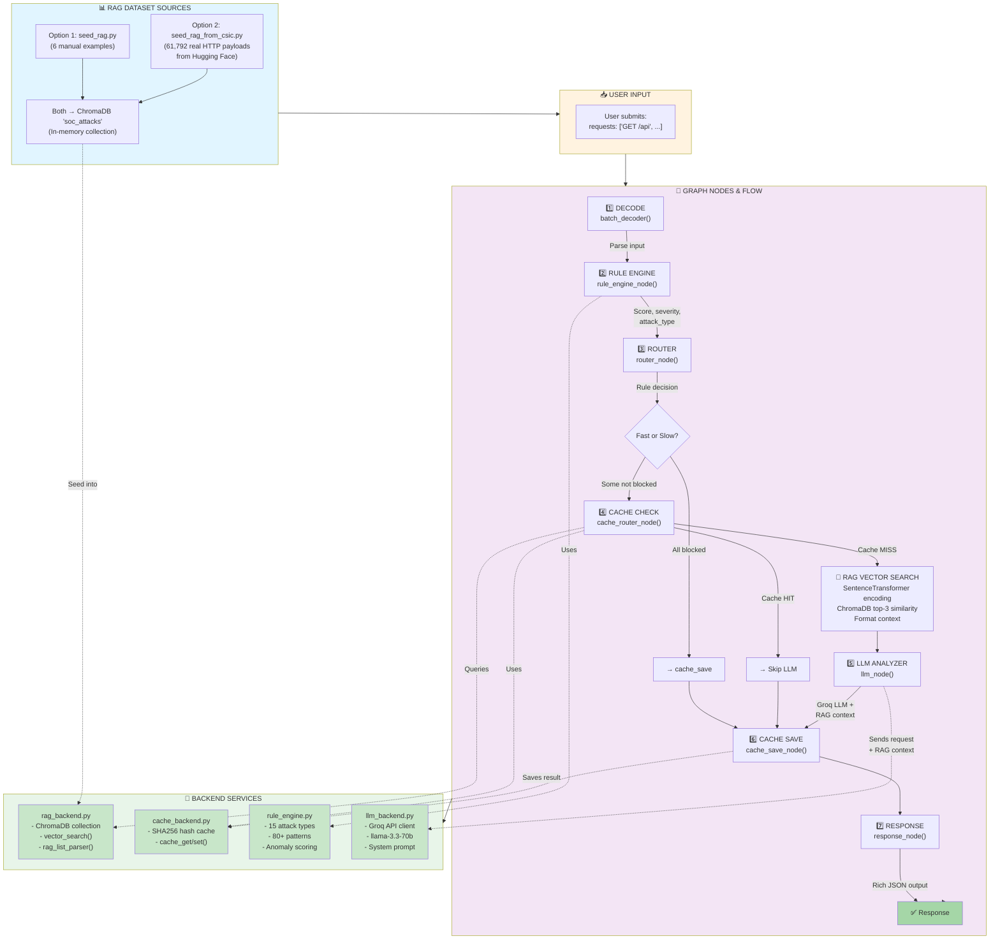

## Complete LangGraph SOC Analyzer - Data Flow & RAG Source



### RAG Dataset Flow Explained

**ChromaDB Storage Structure:**
```
Item {
  ID: SHA256(request_text)           ← Unique fingerprint
  Content: Request text             ← The HTTP payload
  Metadata: {
    "label": "normal" | "anomalous"
    "attack_type": "SQL Injection" | "XSS" | ... | "normal"
  }
  Embedding: [384D vector]          ← SentenceTransformer encoding
}
```

**Vector Search Process (when cache miss):**
1. User request → SentenceTransformer encoding (384D vector)
2. ChromaDB similarity search → top-3 closest stored items
3. Format as RAG context string: `[ANOMALOUS] SQL Injection: id=1 UNION SELECT...`
4. Pass to Groq LLM along with the new request
5. LLM can now say: *"This request pattern matches known SQL injections from training data"*

### Two Dataset Options

| Feature | seed_rag.py | seed_rag_from_csic.py |
|---------|-------------|----------------------|
| **Items** | 6 hard-coded | 61,792 HTTP payloads |
| **Download** | Instant | ~2-5 min first time |
| **Source** | Hard-coded | Hugging Face |
| **Use Case** | Quick testing | Production quality |
| **RAG Quality** | Basic examples | Real attack patterns |
| **Command** | `python scripts/seed_rag.py` | `python scripts/seed_rag_from_csic.py` |

### Complete Request Lifecycle

```
User {requests: ["id=1 UNION SELECT ..."]}
  ↓
[decode] Parse batch → items[]
  ↓
[rule] OWASP CRS check → rule_score=8, attack_type=SQL Injection
  ↓
[router] Decide: blocked? YES → fast path
  ↓
[cache_save] Save to cache (SHA256 key)
  ↓
[response] Return: {label: "attack", attack_type: "SQL Injection", ...}

---

User {requests: ["/api/data?search=test"]}
  ↓
[decode] Parse batch → items[]
  ↓
[rule] OWASP CRS check → rule_score=0, no match
  ↓
[router] Decide: blocked? NO → slow path
  ↓
[cache] Check SHA256 hash → MISS
  ↓
[RAG] Vector search: Find 3 similar past requests
       Return: [[NORMAL] /api/users, [NORMAL] /search?q=..., ...]
  ↓
[llm] Call Groq with:
      "HTTP REQUEST: /api/data?search=test
       RELATED CONTEXT (RAG):
       [NORMAL] /api/users
       [NORMAL] /search?q=test
       
       Return verdict."
  ↓
[cache_save] Save result to SHA256 cache
  ↓
[response] Return: {label: "benign", source: "llm_explainer", ...}
```

### Performance Impact of RAG

**With RAG + Full CSIC2010 Dataset:**
- Cache hit: ~100-200ms (fastest)
- Cache miss: ~1-2 seconds (RAG vector search + LLM)
- LLM receives context → Better classification accuracy
- Fewer false positives

**Without RAG (empty ChromaDB):**
- LLM receives no historical context
- May over-analyze benign requests
- Possible hallucination
- Lower quality results

### Files You Must Know

| File | Purpose | Critical? |
|------|---------|-----------|
| `backends/rag_backend.py` | ChromaDB + vector search | ⭐⭐⭐ |
| `scripts/seed_rag.py` | Load test data | ⭐⭐ |
| `scripts/seed_rag_from_csic.py` | Load real dataset | ⭐⭐⭐ |
| `nodes/nodes_cache.py` | RAG vector search called here | ⭐⭐⭐ |
| `backends/llm_backend.py` | RAG context passed here | ⭐⭐⭐ |
| `graph_app.py` | Node orchestration | ⭐⭐⭐ |
