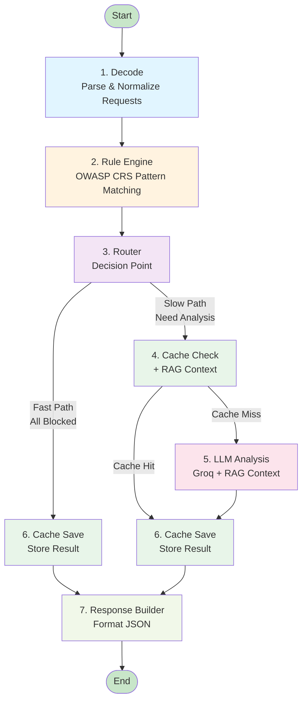
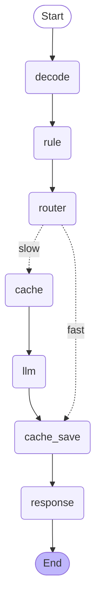
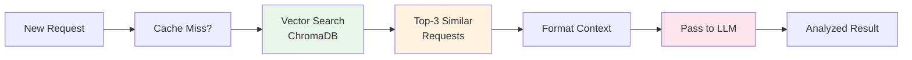

# LangChain SOC Analyzer

**Hybrid HTTP Request Analysis System** using OWASP CRS Rule Engine + LLM (LangGraph)

A production-ready security analysis pipeline that combines:
- **Fast Path**: Rule-based detection (~5ms) for obvious attacks
- **Slow Path**: LLM analysis (~500ms) for complex/unknown patterns
- **Rich Output**: Explainable decisions with evidence & recommendations

## Features

✅ **15 Attack Types Detected**
- SQL Injection, Cross-Site Scripting (XSS), Command Injection
- Directory Traversal, Local File Inclusion, Server-Side Request Forgery (SSRF)
- Server-Side Template Injection (SSTI), XML External Entity (XXE)
- CRLF Injection, NoSQL Injection, LDAP Injection, HTML Injection
- Open Redirect, Web Cache Deception, Cross-Site Request Forgery (CSRF)

✅ **OWASP CRS Anomaly Scoring**
- True ModSecurity Core Rule Set implementation
- Severity-based scoring: CRITICAL=5, ERROR=4, WARNING=3, NOTICE=2
- Threshold-based decisions (PARANOIA_1=5)

✅ **Hybrid Architecture**
- Fast path: Rule engine blocks obvious attacks immediately
- Slow path: LLM analyzes ambiguous/unknown patterns
- Seamless fallback for pattern misses

✅ **Advanced Normalization**
- 3x URL decoding, HTML entity decoding, Unicode escapes
- IIS Unicode (%uXXXX), SQL comment stripping, null byte removal

✅ **Explainable Output**
- Evidence & observed patterns with severity
- Suggested actions (block/log/monitor/allow)
- Learning notes for security education
- Confidence scoring & hallucination detection
- ISO8601 timestamps, flow versioning

✅ **Batch Processing**
- Process 100s of requests in one API call
- Per-item analysis with consistent output format

## Architecture

### System Flow Diagram



### LangGraph Node Flow



### Text Flow

```
Input (batch of HTTP requests)
    ↓
[Decode] → Normalize & parse requests
    ↓
[Rule Engine] → OWASP CRS matching + anomaly scoring
    ↓ 
[Router] → Fast (BLOCK?) or Slow (LLM)?
    ↓
[Cache/RAG] → Optional context lookup
    ↓
[LLM] → Deep analysis if needed
    ↓
[Response Builder] → Formatted output
    ↓
Output (result_json with 20+ fields)
```

## Project Structure

```
.
├── api.py                      # FastAPI endpoint (POST /analyze)
├── graph_app.py                # LangGraph pipeline definition
├── soc_state.py                # State schema (SOCState, SOCItem)
├── batch_decoder.py            # Input normalization
├── rule_engine.py              # OWASP CRS patterns + anomaly scoring
├── nodes_rule.py               # Rule engine node
├── nodes_router.py             # Fast/slow path routing
├── nodes_cache.py              # Cache lookup
├── nodes_llm.py                # LLM analysis node
├── nodes_response.py           # Response formatting
├── response_builder.py         # Output structuring
├── llm_backend.py              # Groq LLM integration
├── .gitignore                  # Git ignore rules
├── RESPONSE_FORMAT_DOC.md      # Output format specification
└── venv_langgraph/             # Python virtual environment
```

## RAG Dataset Setup

The system uses **Retrieval Augmented Generation (RAG)** to provide contextual examples to the LLM.

### Dataset Sources

**Option 1: Quick Test (6 examples)**
```bash
python scripts/seed_rag.py
```
- 3 anomalous examples (SQL Injection, XSS, Path Traversal)
- 3 normal examples
- Instant seeding (<1 second)

**Option 2: Production Quality (61,792 examples)**
```bash
pip install datasets
python scripts/seed_rag_from_csic.py
```
- Real HTTP payloads from CSIC2010 dataset
- From Hugging Face: `nquangit/CSIC2010_dataset_classification`
- First-time download: ~2-5 minutes
- Better RAG context quality

### Verify RAG Data
```bash
python scripts/seed_and_inspect.py
```

### How RAG Works


**Storage:** ChromaDB in-memory collection `"soc_attacks"`  
**Embedding:** SentenceTransformer (all-MiniLM-L6-v2, 384D)  
**Search:** Top-3 semantic similarity  
**Metadata:** `{label: "normal"/"anomalous", attack_type: "SQL Injection"/"XSS"/...}`

## Quick Start

### 1. Clone & Install

```bash
git clone <repo-url>
cd LangChain
python -m venv venv_langgraph
source venv_langgraph/bin/activate  # Windows: venv_langgraph\Scripts\activate
pip install -r requirements.txt
```

### 2. Set Environment Variables

```bash
export GROQ_API_KEY="your-groq-api-key"
```

### 3. Seed RAG Database (Required)

```bash
# Quick test (6 examples)
python scripts/seed_rag.py

# OR production quality (61k examples)
python scripts/seed_rag_from_csic.py
```

### 4. Run API Server

```bash
python -m uvicorn api:app --host 127.0.0.1 --port 8000
```

### 5. Test Endpoint

```bash
curl -X POST http://127.0.0.1:8000/analyze \
  -H "Content-Type: application/json" \
  -d '{
    "requests": [
      "/api/users?id=1 OR 1=1",
      "/search?q=<script>alert(1)</script>",
      "/api/data?filter=../../etc/passwd"
    ]
  }'
```

## Response Format

```json
{
  "result_json": {
    "results": [
      {
        "label": "SQL Injection",
        "attack_group": "sql",
        "attack_type": "sql_injection",
        "confidence": 0.95,
        "risk_score": 10,
        "severity": "High",
        "evidence": ["SQL Injection"],
        "observed_patterns": [{
          "pattern_name": "SQL Injection",
          "description": "Detected 2 rule matches with score 10",
          "severity": "High",
          "rule_matches": 2
        }],
        "suggested_actions": [
          "Block request",
          "Log attack for forensics",
          "Alert security team"
        ],
        "route": "fast",
        "event_type": "fast_block",
        "source": "rule_engine",
        "explanation": "SQL Injection attack detected - request blocked by rule engine",
        "learning_note": "SQL injection attacks can compromise database integrity...",
        "hallucination_suspected": false,
        "hallucination_reasons": [],
        "generated_at": "2026-02-10T10:30:45.123456+00:00"
      }
    ],
    "flow_version": "capstone_http_analyzer.hybrid.v1",
    "generated_at": "2026-02-10T10:30:45.123490+00:00"
  }
}
```

## Configuration

### OWASP CRS Threshold

Edit `rule_engine.py`:
```python
INBOUND_ANOMALY_THRESHOLD = PARANOIA_THRESHOLDS["PARANOIA_1"]  # 5
# Change to:
#   PARANOIA_1 = 5   (default, balanced)
#   PARANOIA_2 = 7   (stricter)
#   PARANOIA_3 = 10  (very strict)
#   PARANOIA_4 = 15  (maximum)
```

### LLM Model

Edit `llm_backend.py`:
```python
model="llama-3.3-70b-versatile"  # Change to other Groq models
```

## Performance Metrics

- **Fast Path**: ~5ms per request (rule engine only)
- **Slow Path**: ~500ms per request (includes LLM)
- **Batch Processing**: 100 requests = ~5-500ms depending on split
- **Memory**: ~500MB (embeddings + models loaded)

## Testing

```bash
# Test new patterns
python test_new_patterns.py

# Direct rule engine testing
python -c "from rule_engine import analyze_request; print(analyze_request('/api/users?id=1 OR 1=1'))"
```

## Troubleshooting

**API returns 500 on slow path:**
- Missing `GROQ_API_KEY` environment variable
- Network issue connecting to Groq API
- LLM service temporarily unavailable

**Rule engine not detecting attack:**
- Pattern may not be in ruleset yet
- Normalization might be stripping the indicator
- Attack bypasses current regex patterns
- → Will be caught by LLM in slow path

**Weird encoding in output:**
- Use `ConvertTo-Json -Depth 10` in PowerShell
- Set terminal encoding: `chcp 65001` (Windows)

## Contributing

1. Add new attack patterns to `rule_engine.py`
2. Test with `test_new_patterns.py`
3. Update this README
4. Push to GitHub

## License

MIT

## Contact

For issues & questions, file a GitHub issue or contact the dev team.

---

**Built with**: LangGraph, FastAPI, Groq LLM, OWASP CRS  
**Status**: Production Ready ✅  
**Last Updated**: Feb 2026
